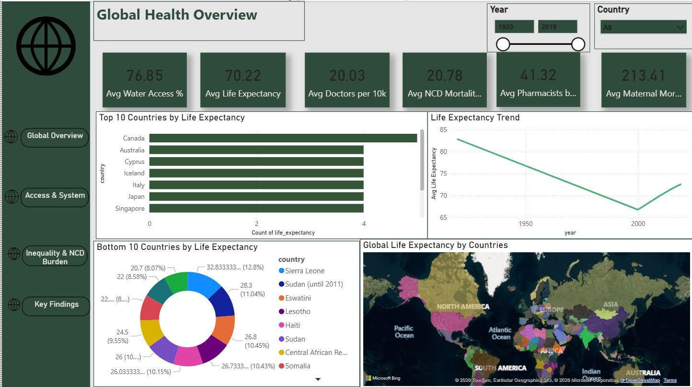
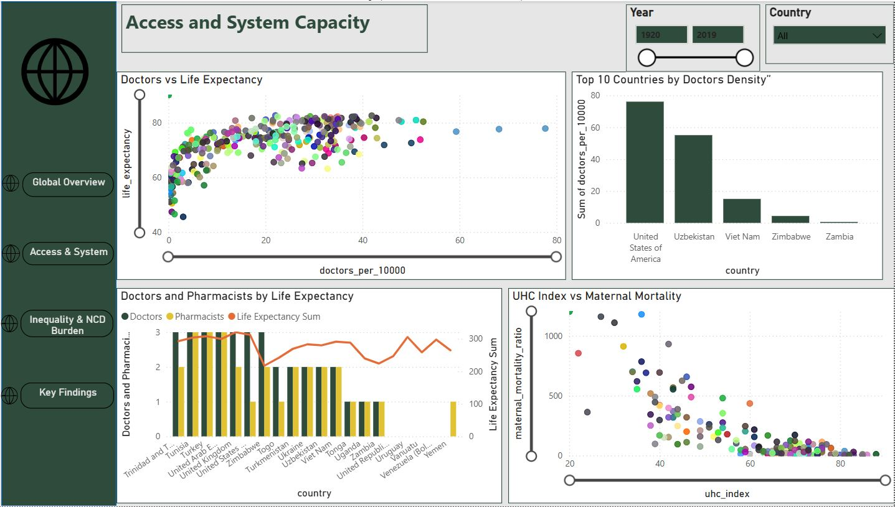
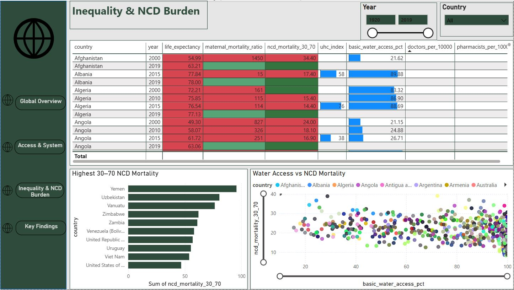
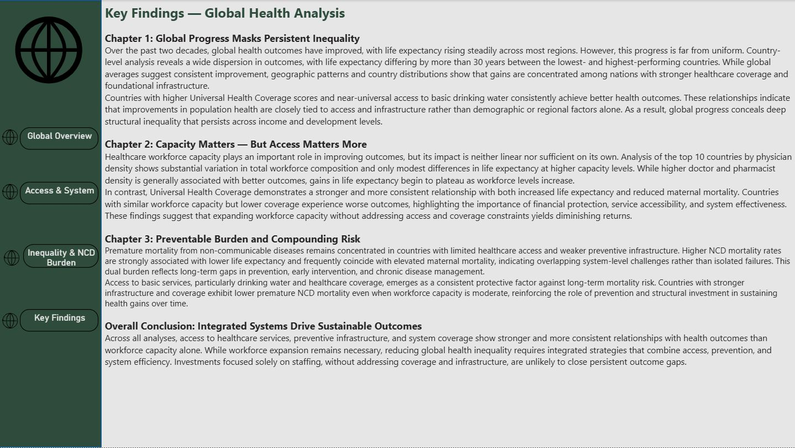

# 🌍 Global Health Outcomes & System Capacity Analysis

## 📌 Project Overview

This project analyzes global health outcomes and healthcare system capacity using World Health Organization (WHO) World Health Statistics data. The objective is to understand how healthcare access, workforce capacity, and basic infrastructure relate to population health outcomes across countries.

The analysis focuses on identifying structural drivers of health inequality and assessing whether improvements in outcomes are more strongly associated with access and coverage or with workforce size alone. The project was designed as a mid-level analytics portfolio piece, emphasizing end-to-end workflow, data modeling, exploratory analysis, and executive-level storytelling.

---

## 📊 Datasets Used

WHO World Health Statistics indicators:

- Life expectancy at birth  
- Maternal mortality ratio  
- Universal Health Coverage (UHC) service coverage index  
- Medical doctors per 10,000 population  
- Pharmacists per 10,000 population  
- Access to basic drinking water services (%)  
- Premature mortality from non-communicable diseases (ages 30–70)

All datasets were cleaned, standardized, and merged into a single analytics table to support consistent cross-country and time-series analysis.

---

## 🛠 Tools & Workflow

- **Excel** – Initial data cleaning, filtering, and standardization  
- **SQL Server** – Staging tables, exploratory analysis, and data validation  
- **Python (Pandas, Matplotlib)** – Data merging, trend analysis, correlation analysis, and local EDA  
- **Power BI** – Data modeling, interactive dashboard development, and insight communication  

**End-to-end workflow:**  
Data cleaning → SQL staging → Python EDA → Power BI dashboard

---

## 📈 Dashboard Pages & Key Insights

### 1️⃣ Global Overview

- Global life expectancy has improved over time, but progress remains uneven across countries.  
- Countries with stronger healthcare coverage and access to basic infrastructure, particularly drinking water, consistently achieve better outcomes.  
- Geographic and country-level patterns reveal persistent inequality that is masked by global averages.

---

### 2️⃣ Access & System Capacity

- Higher healthcare workforce density is generally associated with improved outcomes, but gains diminish at higher capacity levels.  
- Among the top countries by physician density, differences in life expectancy narrow, indicating diminishing returns.  
- Universal Health Coverage shows a stronger and more consistent relationship with improved outcomes than workforce size alone, highlighting the importance of access and system effectiveness.  
- Workforce composition, including both doctors and pharmacists, provides additional context beyond physician counts.

---

### 3️⃣ Inequality & NCD Burden

- Premature mortality from non-communicable diseases is concentrated in countries with weaker healthcare access and preventive infrastructure.  
- High NCD mortality often coincides with elevated maternal mortality, indicating overlapping system-level challenges.  
- Countries with stronger access to basic services consistently experience lower long-term mortality risk.

---

### 4️⃣ Key Findings & Insights

Global health outcomes have improved over time, but progress remains highly uneven across countries. Life expectancy varies widely, with large gaps between the highest- and lowest-performing nations. Countries with stronger healthcare coverage and access to basic services consistently achieve better outcomes, while global averages mask persistent inequality.

Healthcare workforce capacity contributes to improved outcomes, but its impact diminishes at higher levels. Universal Health Coverage demonstrates a stronger and more consistent relationship with life expectancy and maternal outcomes than workforce size alone, highlighting the importance of access, affordability, and system effectiveness.

Premature mortality from non-communicable diseases remains concentrated in countries with limited access to preventive infrastructure and healthcare services. These findings emphasize that sustainable improvements in population health require integrated systems that prioritize access, prevention, and efficient service delivery.

---

## 📁 Repository Structure

